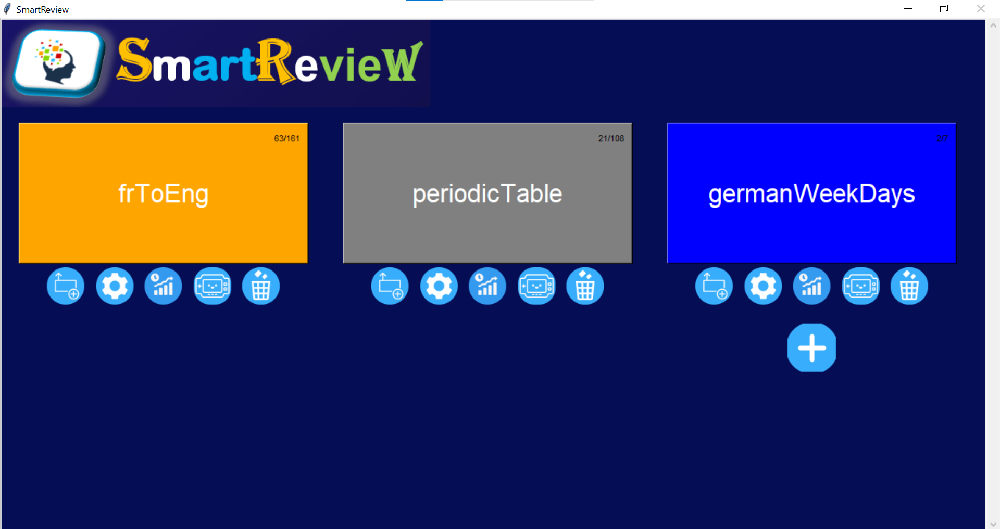

# SmartReview-flashcardDesktopApp-
Application de bureau de flashcards utilisant Tkinter, NumPy et Seaborn pour la visualisation des progrès de l'apprenant enregistré dans des fichiers CSV.

##Interfaces

